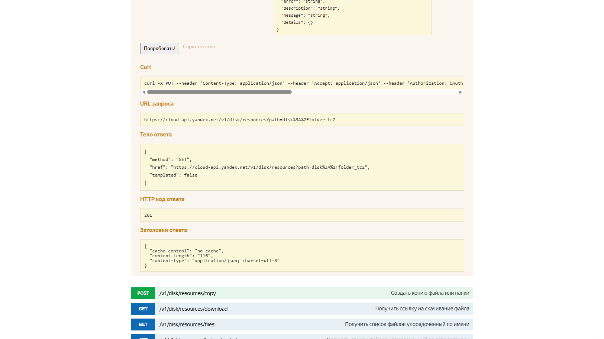
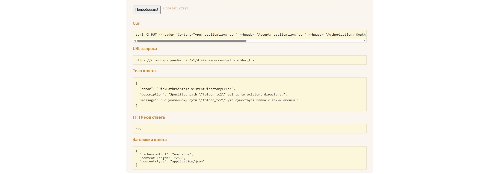

# Задача Т2. Написание баг репорта

## Часть 1. UI

---

#### Требование 1: «Реализована функция поиска по всем файлам и папкам пользователя»

| Критерий | Оценка                                                  |
|:---|:--------------------------------------------------------|
| **Статус** |  Корректное                                             |
| **Проблема** | —                                                       |
| **Риск** | —                                                       |
| **Вопрос аналитику** | Учитываются ли файлы в общих папках / с общим доступом? |

#### Требование 2: «Поле поиска принимает любые буквы/цифры/символы»

| Критерий | Оценка                                                                                      |
|:---|:--------------------------------------------------------------------------------------------|
| **Статус** |  Требует уточнения                                                                          |
| **Проблема** | Не указана максимальная длина запроса; не описано поведение при вводе недопустимых символов |
| **Риск** | Возможны XSS-уязвимости или падение интерфейса при вводе спецсимволов                       |
| **Вопрос аналитику** | Какой лимит символов? Какие символы экранируются?                                           |

#### Требование 3: «Результат работы функции — набор файлов и папок, удовлетворяющих запросу»

| Критерий | Оценка                                                                       |
|:---|:-----------------------------------------------------------------------------|
| **Статус** |  Требует уточнения                                                           |
| **Проблема** | Не указан порядок сортировки результатов (релевантность / дата / алфавит)    |
| **Риск** | Непредсказуемый UX: пользователь может не найти нужный файл в длинном списке |
| **Вопрос аналитику** | По какому критерию сортируются результаты поиска?                            |

#### Требование 4: «В случае, если нет файлов, удовлетворяющих запросу, отображается сообщение: "В вашем Диске не найдено файлов или папок по запросу <...>"»

| Критерий | Оценка                                                                                |
|:---|:--------------------------------------------------------------------------------------|
| **Статус** |  Корректное                                                                           |
| **Проблема** | —                                                                                     |
| **Риск** | —                                                                                     |
| **Вопрос аналитику** | Предусмотрена ли кнопка «Очистить поиск» в этом сообщении? Локализовано ли сообщение? |

#### Требование 5: «Если файл находится в корзине — он также может быть найден поиском»

| Критерий | Оценка                                                                                               |
|:---|:-----------------------------------------------------------------------------------------------------|
| **Статус** | ️ Требует уточнения                                                                                  |
| **Проблема** | Двусмысленность: «может быть найден» — это всегда или настраиваемая опция?                           |
| **Риск** | Пользователь ожидает найти файл, но не видит его (если поиск по корзине отключён)                    |
| **Вопрос аналитику** | Файлы в корзине **всегда** участвуют в поиске? Есть ли визуальная пометка «в Корзине» в результатах? |

---

### 2. Тест-кейсы (UI)

**URL:** `https://disk.yandex.ru`  
**Предусловие для всех кейсов:** Пользователь авторизован, на Диске есть минимум 2 файла с разными именами

---

#### Блок 1: Позитивные сценарии поиска

| ID | Приоритет | Название тест-кейса | Предусловия                                                            | Тестовые данные      | Шаги воспроизведения                                                                                                                                             | Ожидаемый результат                                                                                                                       |
|:---|:---:|:---|:-----------------------------------------------------------------------|:---------------------|:-----------------------------------------------------------------------------------------------------------------------------------------------------------------|:------------------------------------------------------------------------------------------------------------------------------------------|
| **UI-TC-01** | **Blocker** | **Поиск:** Точное совпадение имени существующего файла | 1. Пользователь авторизован 2. Файл `report.pdf` в корне Диска      | Запрос: `report.pdf` | 1. Открыть https://disk.yandex.ru 2. Кликнуть в поле поиска в шапке 3. Ввести `report.pdf` 4. Нажать `Enter` или кликнуть 🔍 5. Проверить результаты | **Результат:** Файл `report.pdf` отображается первым в списке **Интерфейс:** Нет ошибок загрузки, подсветка совпадения в названии      |
| **UI-TC-02** | **Critical** | **Поиск:** Частичное совпадение (подстрока в имени) | 1. Пользователь авторизован 2. Файл `mannual_report.pdf` существует | Запрос: `report`     | 1. Открыть Яндекс.Диск 2. В поле поиска ввести `report` 3. Нажать `Enter` 4. Проверить результаты                                                       | **Результат:** Файл `mannual_report.pdf` отображается в списке **Интерфейс:** Подсветка подстроки `report` в названии файла            |
| **UI-TC-03** | **High** | **Поиск:** Поиск по имени папки | 1. Пользователь авторизован 2. Папка `TestSearch` существует        | Запрос: `TestSearch` | 1. Открыть Яндекс.Диск 2. Ввести `TestSearch` в поиск 3. Нажать `Enter` 4. Кликнуть по результату                                                       | **Результат:** Папка `TestSearch` отображается в результатах **Интерфейс:** При клике — переход внутрь папки                           |
| **UI-TC-04** | **High** | **Поиск:** Регистронезависимый поиск | 1. Пользователь авторизован 2. Файл `test1.docx` существует         | Запрос: `test1.docx` | 1. Открыть Яндекс.Диск 2. Ввести `test1.docx` 3. Нажать `Enter`                                                                                            | **Результат:** Файл `test1.docx` найден (регистр не влияет) **Интерфейс:** Корректное отображение имени файла с оригинальным регистром |

---

#### Блок 2: Негативные сценарии и граничные значения

| ID | Приоритет | Название тест-кейса | Предусловия | Тестовые данные | Шаги воспроизведения | Ожидаемый результат |
|:---|:---:|:---|:---|:---|:---|:---|
| **UI-TC-05** | **Critical** | **Поиск:** Несуществующий файл — корректное сообщение | 1. Пользователь авторизован 2. Файла с таким именем нет | Запрос: `xyz_nonexistent_123` | 1. Открыть Яндекс.Диск 2. Ввести `xyz_nonexistent_123` 3. Нажать `Enter` 4. Проверить отображение сообщения | **Результат:** Отображается сообщение: `"В вашем Диске не найдено файлов или папок по запросу xyz_nonexistent_123"` **Интерфейс:** Кнопка «Очистить поиск» активна |
| **UI-TC-06** | **Medium** | **Поиск:** Пустой запрос | 1. Пользователь авторизован | Запрос: `` (пустая строка) | 1. Открыть Яндекс.Диск 2. Очистить поле поиска 3. Нажать `Enter` | **Результат:** Результаты не меняются / возвращается список всех файлов **Интерфейс:** Нет ошибок валидации, интерфейс стабилен |
| **UI-TC-07** | **Medium** | **Поиск:** Только пробелы в запросе | 1. Пользователь авторизован | Запрос: `   ` (3 пробела) | 1. Открыть Яндекс.Диск 2. Ввести 3 пробела 3. Нажать `Enter` | **Результат:** Запрос игнорируется / сообщение «Ничего не найдено» **Интерфейс:** Нет JS-ошибок в консоли (F12) |
| **UI-TC-08** | **Low** | **Поиск:** Очень длинный запрос (>255 символов) | 1. Пользователь авторизован | Запрос: `a` × 300 символов | 1. Открыть Яндекс.Диск 2. Вставить 300 символов `aaaa...` 3. Нажать `Enter` | **Результат:** Запрос обрезается до лимита **ИЛИ** сообщение «Слишком длинный запрос» **Интерфейс:** Нет падения интерфейса, нет 500-ошибок |

---

#### Блок 3: Безопасность и спецсимволы

| ID | Приоритет | Название тест-кейса | Предусловия | Тестовые данные | Шаги воспроизведения | Ожидаемый результат |
|:---|:---:|:---|:---|:---|:---|:---|
| **UI-TC-09** | **High** | **Поиск:** Спецсимволы в запросе | 1. Пользователь авторизован 2. Файл `file@#$.txt` существует | Запрос: `@#$%^&*()` | 1. Открыть Яндекс.Диск 2. Ввести `@#$%^&*()` 3. Нажать `Enter` | **Результат:** Файл найден **ИЛИ** «Ничего не найдено» **Интерфейс:** Нет ошибок 500, нет JS-крашей, текст экранирован |
| **UI-TC-10** | **Critical** | **Поиск:** XSS-попытка в запросе | 1. Пользователь авторизован | Запрос: `` | 1. Открыть Яндекс.Диск 2. Ввести `` 3. Нажать `Enter` 4. Проверить консоль (F12) | **Результат:** Скрипт **не исполняется** **Интерфейс:** Текст отображается как plain text / экранирован **Консоль:** Нет ошибок выполнения |
| **UI-TC-11** | **Medium** | **Поиск:** SQL-подобные символы в запросе | 1. Пользователь авторизован | Запрос: `' OR '1'='1` | 1. Открыть Яндекс.Диск 2. Ввести `' OR '1'='1` 3. Нажать `Enter` | **Результат:** Нет утечки данных / ошибок БД в интерфейсе **Интерфейс:** Корректное «Ничего не найдено» или результаты |

---

#### Блок 4: Поиск файлов в Корзине

| ID | Приоритет | Название тест-кейса | Предусловия | Тестовые данные | Шаги воспроизведения | Ожидаемый результат |
|:---|:---:|:---|:---|:---|:---|:---|
| **UI-TC-12** | **High** | **Поиск:** Файл в Корзине находится поиском | 1. Пользователь авторизован 2. Файл `deleted.txt` в Корзине | Запрос: `deleted.txt` | 1. Открыть Яндекс.Диск 2. Ввести `deleted.txt` 3. Нажать `Enter` 4. Проверить результаты | **Результат:** Файл `deleted.txt` отображается в результатах **Интерфейс:** Присутствует визуальная пометка «в Корзине» |
| **UI-TC-13** | **Medium** | **Поиск:** Папка в Корзине находится поиском | 1. Пользователь авторизован 2. Папка `OldProject` в Корзине | Запрос: `OldProject` | 1. Открыть Яндекс.Диск 2. Ввести `OldProject` 3. Нажать `Enter` | **Результат:** Папка найдена с пометкой «в Корзине» **Интерфейс:** При клике — переход в Корзину → папка |

---

### 3. Баг-репорт (UI)

#### Bug Report: UI-BUG-001

| Поле | Значение                                                                                                      |
|:---|:--------------------------------------------------------------------------------------------------------------|
| **ID** | `UI-BUG-001`                                                                                                  |
| **Заголовок** | Ошибка при переименовании файла — ложное сообщение «Файл используется», хотя файл не открыт и не заблокирован |
| **Компонент** |  File Operations / Rename                                                                                     |
| **Приоритет** | **High** (блокирует основную функцию)                                                                         |
| **Серьёзность** | **Major** (функция не работает, но есть обходные пути)                                                        |
| **Окружение** | Windows 11, Chrome 145, Yandex Disk Web 2026.02                                                               |

**Предусловия:**
- Пользователь авторизован в Яндекс.Диск
- На Диске есть файл `test1.docx`
- Файл **не открыт** в других вкладках / приложениях
- Файл **не скачивается** и **не синхронизируется**

**Шаги для воспроизведения:**
1. Открыть браузер Chrome и перейти по URL: `https://disk.yandex.ru`
2. Авторизоваться под тестовым пользователем
3. Найти файл `test1.docx` в списке файлов
4. Кликнуть правой кнопкой мыши по файлу → выбрать **«Переименовать»**   *или* выделить файл и нажать клавишу `F2`
5. В поле ввода имени ввести новое значение: `test1_1.docx`
6. Нажать клавишу `Enter` для подтверждения переименования
7. Зафиксировать результат

---

**Фактический результат:**

После шага 6 отображается модальное окно / всплывающее уведомление:
«Не удалось переименовать. Документ редактируется»

Файл остаётся со старым именем: test1.docx

Переименование не выполнено.

---

**Ожидаемый результат:**

После шага 6:

Файл успешно переименовывается в: test1_1.docx

Сообщение об ошибке НЕ отображается

В интерфейсе отображается обновлённое имя файла

**Вложения:**

---

## Часть 2.API тестирование.

**Метод:**
PUT /v1/disk/resources 

**Заголовки:**

- Content-Type: application/json 
- Authorization: [token]

**Параметры запроса:**
- path – путь к создаваемой папке  
- fields – список атрибутов для возврата  

**Коды ответов:**
- 200 — Успешно, папка создана  
- 400 — Ошибка данных или путь уже существует  
- 401 — Неверный или отсутствующий токен  
### 1.Протестировать требования.

#### Требование 1: «В случае успешного выполнения запроса получен ответ 200»

| Критерий | Оценка                                                                                               |
|:---|:-----------------------------------------------------------------------------------------------------|
| **Статус** |  Некорректное / Требует уточнения                                                                    |
| **Проблема** | Несоответствие REST-стандарту: для создания ресурса стандартом является `201 Created`, а не `200 OK` |
| **Риск** | Клиенты, ожидающие `201`, могут некорректно обработать ответ                                         |
| **Вопрос аналитику** | Какой код является корректным: `200` или `201`? Соответствует ли API REST-конвенциям?                |

#### Требование 2: «Если данные некорректны — ответ 400»

| Критерий | Оценка                                                                                                     |
|:---|:-----------------------------------------------------------------------------------------------------------|
| **Статус** |  Некорректное / Неоднозначное                                                                              |
| **Проблема** | Не указано, какие именно данные считаются некорректными; не разделены ошибки валидации и конфликт ресурсов |
| **Риск** | Клиент не сможет программно отличить «неверный формат path» от «путь уже занят»                            |
| **Вопрос аналитику** | Какие ошибки валидации возвращают `400`? Используется ли `409 Conflict` для существующего пути?            |

#### Требование 3: «При попытке создания по существующему пути — ответ 400»

| Критерий | Оценка                                                                                |
|:---|:--------------------------------------------------------------------------------------|
| **Статус** |  Некорректное / Противоречит фактическому поведению API                               |
| **Проблема** | Фактически API возвращает `409 Conflict`, а не `400 Bad Request`                      |
| **Риск** | Документация вводит в заблуждение, клиенты реализуют неверную логику обработки ошибок |
| **Вопрос аналитику** | Актуализировать документацию: указать `409` для конфликта существующего ресурса       |

#### Требование 4: «Параметр path — путь к создаваемой папке»

| Критерий | Оценка                                                                                                       |
|:---|:-------------------------------------------------------------------------------------------------------------|
| **Статус** |  Некорректное / Неполное                                                                                     |
| **Проблема** | Не указаны: допустимые символы, поддержка вложенных папок, максимальная длина, обязательный префикс `disk:/` |
| **Риск** | Клиенты передают невалидные пути, получают `400` без понятного сообщения                                     |
| **Вопрос аналитику** | Добавить спецификацию формата `path`: regex, длина, разрешённые/запрещённые символы                          |

#### Требование 5: «Параметр fields — список возвращаемых атрибутов»

| Критерий | Оценка                                                                                         |
|:---|:-----------------------------------------------------------------------------------------------|
| **Статус** |  Некорректное / Неполное                                                                       |
| **Проблема** | Не указан список допустимых значений, обязательность параметра, поведение при неизвестном поле |
| **Риск** | Клиенты передают недопустимые значения, получают непредсказуемый ответ                         |
| **Вопрос аналитику** | Добавить перечень допустимых полей (`name`, `path`, `type`, `size`...) и поведение при ошибке  |

---

### 2. Тест-кейсы (API)

| № | ID | Приоритет | Название тест-кейса | Входные данные | Ожидаемый ответ |
|:---|:---|:---:|:---|:---|:---|
| 1 | **API-TC-01** | **Blocker** | **PUT /resources:** Успешное создание новой папки (валидный path) | `path=disk:/folder_tc2`, валидный токен | **201 Created** (или 200) Папка создана на Диске Тело содержит метаданные папки |
| 2 | **API-TC-02** | **Critical** | **PUT /resources:** Создание папки по уже существующему пути | `path=disk:/folder_tc2` (папка уже есть), валидный токен | **409 Conflict** Тело: `{"error": "DiskPathPointsToExistentDirectoryError", ...}` |
| 3 | **API-TC-03** | **Critical** | **PUT /resources:** Отсутствие заголовка Authorization | `path=disk:/folder_new`, токен не передан | **401 Unauthorized** Тело: `{"error": "UnauthorizedError"}` |
| 4 | **API-TC-04** | **Critical** | **PUT /resources:** Неверный/истёкший токен | `path=disk:/folder_new`, `Authorization: OAuth invalid_token` | **401 Unauthorized** |
| 5 | **API-TC-05** | **Major** | **PUT /resources:** Некорректный формат path (без префикса disk:/) | `path=/folder_invalid`, валидный токен | **400 Bad Request** Тело: сообщение об ошибке валидации path |
| 6 | **API-TC-06** | **Major** | **PUT /resources:** Path с запрещёнными символами | `path=disk:/folder<bad>`, валидный токен | **400 Bad Request** |
| 7 | **API-TC-07** | **Medium** | **PUT /resources:** Параметр fields — возврат только запрошенных полей | `path=disk:/folder_fields`, `fields=name,path` | **201 Created** Тело содержит только поля `name` и `path` |
| 8 | **API-TC-08** | **Low** | **PUT /resources:** Параметр fields с неизвестным полем | `path=disk:/folder_unknown`, `fields=unknown_field` | **201 Created** (неизвестное поле игнорируется) **ИЛИ** **400 Bad Request** |

---

### 3. Баг-репорты (API)

---

####  Bug Report: API-002

| Поле | Значение |
|:---|:---|
| **ID** | `API-002` |
| **Заголовок** | `PUT /v1/disk/resources:` Сервер возвращает `201 Created` вместо ожидаемого `200 OK` при успешном создании папки |
| **Компонент** | API: Disk Resources |
| **Приоритет** | Medium |
| **Серьёзность** | Minor (функционально работает, но нарушает документацию) |
| **Окружение** | Windows 11, Chrome 145, Yandex Poligon Web 2026.02 |

**Предусловия:**
- Получен валидный OAuth-токен
- На Диске нет папки `/folder_tc2`

**Шаги для воспроизведения:**
1. Открыть Яндекс.Полигон: https://yandex.ru/dev/disk/poligon/
2. В поле **Token** вставить валидный OAuth-токен
3. Выбрать метод **PUT** `/v1/disk/resources`
4. Заполнить параметр `path`: `disk:/folder_tc2`
5. Параметр `fields` оставить пустым
6. Нажать кнопку **«Выполнить»**
7. Зафиксировать код ответа и тело ответа

**Фактический результат:**

HTTP Status: 201 Created

Тело ответа:
{
"method": "GET",
"href": "https://cloud-api.yandex.net/v1/disk/resources?path=disk%3A%2Ffolder_tc2",
"templated": false
}

Папка `folder_tc2` создана на Диске.

**Ожидаемый результат (согласно документации):**

HTTP Status: 200 OK

Папка folder_tc2 создана на Диске

**Вложения:**

---

#### Bug Report: API-003

| Поле | Значение |
|:---|:---|
| **ID** | `API-003` |
| **Заголовок** | `PUT /v1/disk/resources:` Сервер возвращает `409 Conflict` вместо ожидаемого `400 Bad Request` при создании существующей папки |
| **Компонент** | API: Disk Resources |
| **Приоритет** | Medium |
| **Серьёзность** | Minor (функционально работает, но документация вводит в заблуждение) |
| **Окружение** | Windows 11, Chrome 145, Yandex Poligon Web 2026.02 |

**Предусловия:**
- Получен валидный OAuth-токен
- На Диске **уже есть** папка `/folder_tc2`

**Шаги для воспроизведения:**
1. Открыть Яндекс.Полигон: https://yandex.ru/dev/disk/poligon/
2. В поле **Token** вставить валидный OAuth-токен
3. Выбрать метод **PUT** `/v1/disk/resources`
4. Заполнить параметр `path`: `disk:/folder_tc2` (папка уже существует)
5. Параметр `fields` оставить пустым
6. Нажать кнопку **«Выполнить»**
7. Зафиксировать код ответа и тело ответа

**Фактический результат:**

HTTP Status: 409 Conflict

Тело ответа:
{
"error": "DiskPathPointsToExistentDirectoryError",
"description": "Specified path "/folder_tc2" points to existent directory.",
"message": "По указанному пути "/folder_tc2" уже существует папка с таким именем."
}

**Ожидаемый результат:**

HTTP Status: 400 Bad Request

Тело: {"error": "...", "message": "..."}

**Вложения:**

---

